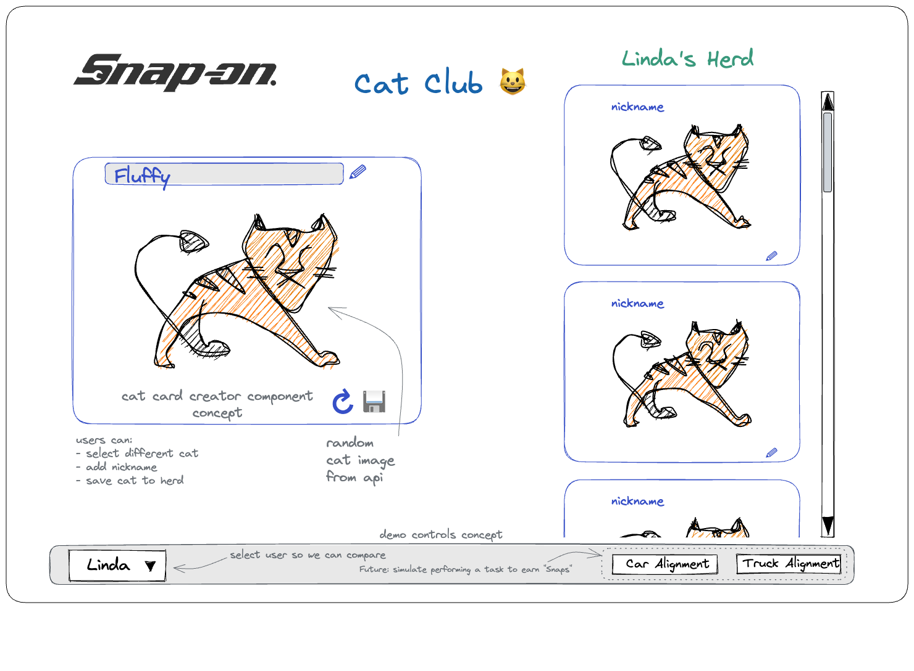

## Cat Club

Snap-on has learned that workshop staff:
- perform best when allowed frequent breaks from their tasks
- may not be allowed to use their phones during work for entertainment
- love cats

Monica, the Common UI product owner, has asked you to improve a prototype for a Snap-on Cat Club. The Cat Club will ship as part of the Common UI suite used on our new machines. Our machines are used in workshops around the world. The monitors on our machines are normally standard 1080p displays so the Cat Club should be designed for that resolution.

The idea is that the workers in any particular workshop can maintain a herd of cats. Workers can grow their herds using Snaps (coins) they earn while performing work tasks. The mock-up doesn't yet have any use of the coins to buy or sell cats. In the future different breeds could have different values. This is a gamification feature. The Cat Club will be a place where workers can take a break and view their herds and interact with them. Right now, 'interacting with them' means displaying them to view. In the future, we will add more features to the Cat Club.

The user's cat herd consists of Cat Cards. Users grow their herd by using the Cat Card Creator component. Monica has generated a simple mock-up for what a Cat Card Creator could look like and has created a simple base app with user data that you can use to get started. Cat images and details are sourced from https://api.thecatapi.com/. You should apply for a developer license and use that in the local configuration file.

As this is a new feature for Common UI, Monica has asked that the app be built in 'demonstration mode' so that she may show the features to management. She has suggested that you create a footer bar that includes a selector for the active user. This will be removed before we ship the app. She also noticed that the images from thecatapi.com are not the same size so she would like them to auto-fit in a consistent way since all the Cat Cards should be the same size.

A very simple, unstyled proof of concept has been created for you to get started.

### Your tasks: 
- fix the layout problem so the columnns and rows of the concept app works as expected
- style the CatCard component
- fix the problem with the image sizes
- create the CatCardCreator component. It should allow the user to select a cat image and name their cat. The user should be able to save the cat to their herd. Keep things simple and just use the random cat image from the API for now. The user should be able to get a new random cat image by clicking on the reload icon. You do not have to implement the save functionality.
- be ready to discuss your approach and decisions during the follow-up interview. If there were things you couldn't get to because of time constraints, please be prepared to discuss what you would do if you had more time. 

### Bonus tasks:
- style the app... black is not a good color for a cat app and we haven't included any Snap-on branding yet.
- implement the save functionality for the CatCardCreator
- create a responsive layout so we can add a mobile version later
- add an interaction feature of your choice to the herd

### Notes
- Try to use DRY principles and keep things simple. We are looking for a good understanding of Typescript, React and CSS.
- It is normal to have questions! Please ask. You have been given a contact channel to use for questions. Please use it.
- The mock / demo app you have been given is not perfect. It is an example of a very quick and dirty proof of concept. If you notice areas where it can be improved, either make a note of it or go ahead and improve it. We will discuss it during the follow-up interview.

### Data
Mock data is provided in a [json file](db.json) and is served by [json-server](https://github.com/typicode/json-server). You can run the server with `npm run db`. The server is available at http://localhost:3001 In actual production we would use a real database, but for this exercise we are using a mock database. This is not something you need to worry about or improve.

